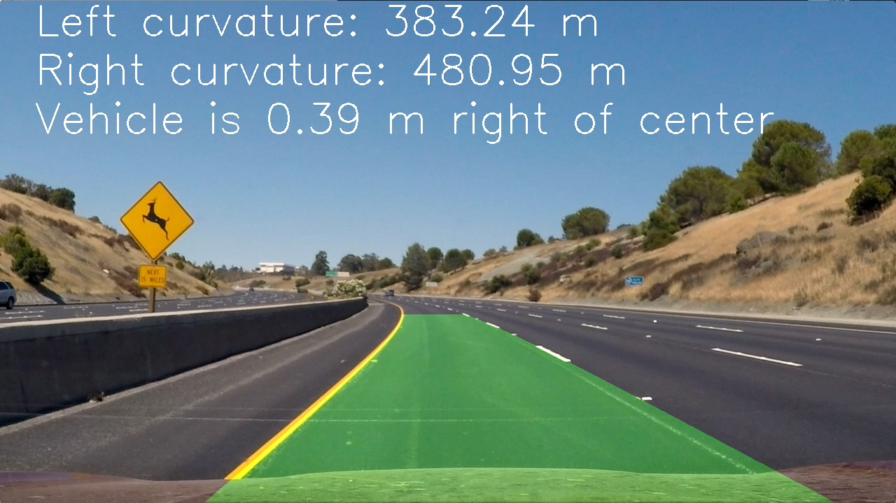

## **Advanced Lane Line Detection***

## Rohit Kukreja

**Youtube video**

 Goal of the project is  to write a software pipeline to identify the lane boundaries in a video.
 Check out the [Github](https://github.com/rohit5945/CarND-Advanced-Lane-Lines) for this project   

The Project
---

The goals / steps of this project are the following:

* Compute the camera calibration matrix and distortion coefficients given a set of chessboard images.
* Apply a distortion correction to raw images.
* Use color transforms, gradients, etc., to create a thresholded binary image.
* Apply a perspective transform to rectify binary image ("birds-eye view").
* Detect lane pixels and fit to find the lane boundary.
* Determine the curvature of the lane and vehicle position with respect to center.
* Warp the detected lane boundaries back onto the original image.
* Output visual display of the lane boundaries and numerical estimation of lane curvature and vehicle position.

The images for camera calibration are stored in the folder called `camera_cal`.  The images in `test_images` are for testing your pipeline on single frames.  If you want to extract more test images from the videos, you can simply use an image writing method like `cv2.imwrite()`, i.e., you can read the video in frame by frame as usual, and for frames you want to save for later you can write to an image file.  

## Camera Calibration##

The first step we will take is to find the calibration matrix, along with distortion coefficient for the camera that was used to take pictures of the road. This is necessary because the convex shape of camera lenses curves light rays as the enter the pinhole, therefore causing distortions to the real image. Therefore lines that are straight in the real world may not be anymore on our photos.

To compute the camera the transformation matrix and distortion coefficients, we use a multiple pictures of a chessboard on a flat surface taken by the same camera. OpenCV has a convenient method called findChessboardCorners that will identify the points where black and white squares intersect and reverse engineer the distorsion matrix this way. The image below shows the identified chessboard corners traced on a sample image

We can see that corners are very well identified. Next we run our chessboard finding algorithm over multiple chessboard images taken from different angles to identify image and object points to calibrate the camera. The former refers to coordinates in our 2D mapping while the latter represents the real-world coordinates of those image points in 3D space (with z axis, or depth = 0 for our chessboard images). Those mappings enable us to find out how to properly undistort an image taken from the same camera. You can witness it's effectiveness on the image below.

## Gradient and Color thresholding ##

After calibrating the input images we do a thresholding on the image using the gradient on different color channels.

Steps:
1. Convert from RGB to HLS 
2. take the S-channel and L-channel
3. Perform gradient on L-channel and color thresholding on L- channel
4. create a binary image using OR(|) for both the thresholds.

## Perspective Transformation##

Perspective transformation is done for better detecting the curved lanes.
We do a transformation to birds eye view .
We now need to define a trapezoidal region in the 2D image that will go through a perspective transform to convert into a bird's eye view.

We then define 4 extra points which form a rectangle that will map to the pixels in our source trapezoid:

src=np.float32(
        [[690, 450],
         [1110, 720],
         [175, 720],
         [595, 450]
        ])
    #desired coordinates
    dsrd=np.float32(
        [[980, 0],
         [980, 720],
         [300, 720],
         [300, 0]
        ])

## Polynomial fitting ##

Since we now know the starting x position of pixels most likely to yield a lane line, we run a sliding windows search in an attempt to "capture" the pixel coordinates of our lane lines.

From then, it is we simply compute a second degree polynomial, via numpy's polyfit, to find the coefficients of the curves that best fit the left and right lane lines.

One way we improve the algorithm is by saving the previously computed coefficients for frame t-1 and attempt to find our lane pixels from those coefficients. However, when we do not find enough lane line pixels (less than 85% of total non zero pixels), we revert to sliding windows search to help improve our chances of fitting better curves around our lane.

## Warp image##

Finally, we draw the inside the of the lane in green and unwarp the image, thus moving from bird's eye view to the original image. . We also add textual information about lane curvature and vehicle's center position:

## Radius of curvature ##

We also compute the lane curvature by calculating the radius of the smallest circle that could be a tangent to our lane lines - on a straight lane the radius would be quite big. We have to convert from pixel space to meters (aka real world units) by defining the appropriate pixel height to lane length and pixel width to lane width ratios:

**Height ratio: 32 meters / 720 px**
self.ym_per_px = self.real_world_lane_size_meters[0] / self.img_dimensions[0]

**Width ratio: 3.7 meters / 800 px**
self.xm_per_px = self.real_world_lane_size_meters[1] / self.lane_width_px

I tried to manually estimate the length of the road on my bird's eye view images by referring to data from this resource: every time a car has travelled it has passed 40 feet (around 12.2 meters).

Moreover, you can find more information on the mathematical underpinnings of radius of curvature via the following link.

We also compute the car's distance from the center of the lane by offsetting the average of the starting (i.e. bottom) coordinates for the left and right lines of the lane, subtract the middle point as an offset and multiply by the lane's pixel to real world width ratio.

